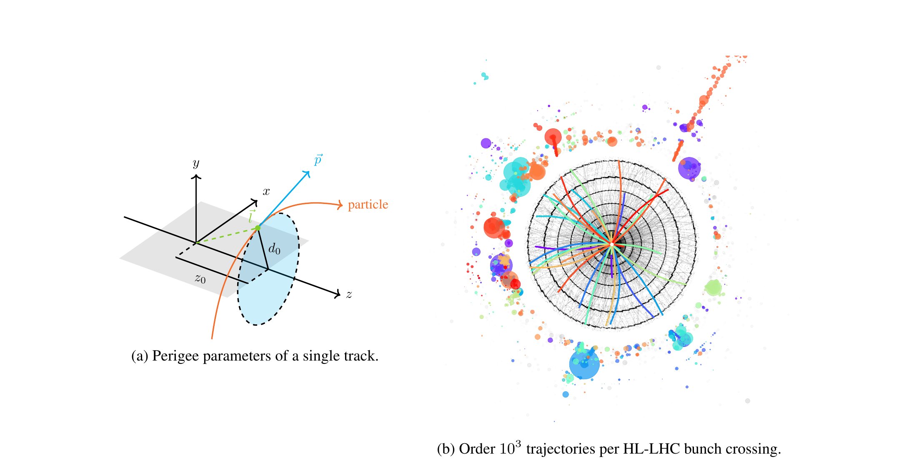
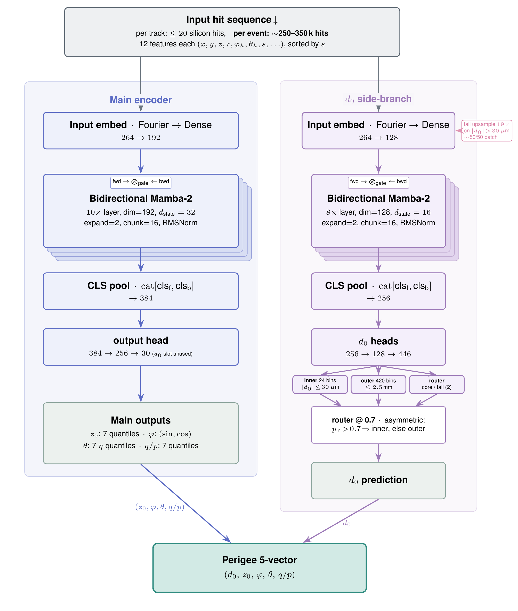

# Bidirectional state space models for charged-particle trajectory regression

Code release for a Mamba-2-based regressor of the five perigee track parameters
`(d0, z0, φ, θ, q/p)` from raw silicon-detector hits, evaluated against the
ACTS combinatorial Kalman filter (CKF) on the
[CERN/ColliderML-Release-1](https://huggingface.co/datasets/CERN/ColliderML-Release-1)
ttbar dataset.

The repository contains the model, three encoder variants (bidirectional
Mamba-2 with state pool, bidirectional Mamba-2 with CLS pool, and a
parameter-matched flash-attn2 transformer), the loss family (quantile,
circular, Gaussian-NLL), the data preprocessing pipeline, and a
publication-quality plotting pipeline that emits per-parameter residual
plots, RMS-vs-η panels, and bootstrap-error tables.

**No checkpoints are shipped.** Train your own, or wire your existing
checkpoint into the fine-tune YAML via `pretrained_ckpt_path`.

## The track-fitting problem



**(a)** Perigee parameters of a charged-particle track in a solenoidal
magnetic field. The trajectory (orange) is a helix; **r** is the point
of closest approach to the beamline. `d0` is the perpendicular distance
from **r** to the *z*-axis (within the transverse plane shown faintly in
blue at *z = z0*); `z0` is the *z*-coordinate of **r**; `φ` and `θ`
parametrise the momentum **p** at the perigee; `q/p` is the signed
inverse momentum. *Schematic — not to scale.*

**(b)** A single proton–proton bunch crossing at the High-Luminosity
LHC produces thousands of charged-particle trajectories that must be
reconstructed from the sparse silicon-detector hit collection.
*Track finding* assigns hits to candidate trajectories and *track
fitting* estimates the five perigee parameters of each candidate; this
work targets the latter, given the hit-to-track assignment. Panel (b)
is reproduced from the ColliderML dataset paper
[arXiv:2512.15230](https://arxiv.org/abs/2512.15230) (Elitez et al.,
2025), which also provides the ttbar simulation used to train and
evaluate the models in this repository.

## Architecture



Vector source: [`architecture.pdf`](architecture.pdf). The PNG above is a
300 DPI rasterisation for inline rendering.

A 12-feature per-hit input is sorted along the signed arc length `s` from
the interaction point and embedded with Fourier features into a 192-d
token sequence. The encoder runs forward + backward selective scans
(gated merge adapted from Vision Mamba); a learned CLS token at each scan
terminus pools the final hidden states. A shared `output_head` regresses
the five perigee track parameters under a seven-quantile pinball loss,
with a circular loss for `φ` and η-space parameterisation for `θ`.

## Hardware

- Pretraining one config: ~60–100 h on **1× H100 80 GB** (batch size kept
  small for regularisation; extra GPUs do not help).
- Fine-tuning one config: ~2 days on **2× H100 80 GB DDP**
  (set via `trainer.devices: [0,1]`).
- Inference + plots: <2 h on a single H100 (bootstrap stats add ~3
  min/run).

Minimum to run anything: 1× GPU with ≥40 GB VRAM, 16 GB system RAM,
~150 GB scratch for the preprocessed dataset.

## Layout

```
.
├── README.md
├── LICENSE                          ← GPL-3.0-or-later
├── architecture.{pdf,png}           ← model diagram
├── pyproject.toml                   ← pixi/hatchling project config
├── src/hepattn/                     ← library code
│   ├── models/                      ← attention, encoder, dense, posenc …
│   ├── callbacks/                   ← Lightning callbacks
│   ├── utils/                       ← logger, dataset helpers, masks …
│   └── experiments/colliderml_regr/
│       ├── train.py                 ← Lightning CLI entry
│       ├── data.py                  ← memory-mapped dataset
│       ├── model.py                 ← TrackParameterRegressor LightningModule
│       ├── losses.py                ← quantile / circular / Gaussian losses
│       ├── mamba_state.py           ← BidirectionalMambaEncoder (state pool)
│       ├── mamba_cls.py             ← BidirectionalMambaCLSEncoder (CLS pool)
│       ├── transformer_encoder.py   ← parameter-matched transformer baseline
│       ├── paper_plots/             ← publication-quality plot pipeline
│       ├── scripts/                 ← preprocess + create_split
│       ├── utils/                   ← selection helpers
│       └── config/<arch>/<stem>.yaml
└── scripts/
    ├── 00_download_data.sh
    ├── 01_train.sh CONFIG
    ├── 02_evaluate.sh CONFIG
    └── 03_paper_plots.sh
```

## Quickstart

```bash
# 1. install pixi env (5–10 min on a fresh machine; <1 min thereafter
#    because pixi caches the compiled mamba-ssm + causal-conv1d wheels).
#    Requires nvcc + a CUDA-12.x-compatible GCC.
pixi install

# 2. dataset — print the download / preprocess / split commands for your
#    DATA_ROOT and run them. Raw download ~600 GB, preprocessed ~140 GB.
export DATA_ROOT=/path/to/large/scratch
bash scripts/00_download_data.sh

# 3. train one or more configs
bash scripts/01_train.sh pretrain_ssm_cls
bash scripts/01_train.sh finetune_ssm_cls_muon  # set pretrained_ckpt_path first

# 4. evaluate (writes test_predictions.h5)
bash scripts/02_evaluate.sh finetune_ssm_cls_muon

# 5. publication plots + cross-run summary tables
bash scripts/03_paper_plots.sh
```

Outputs:
- `logs/paper_plots/<stem>/plots/*.{pdf,png}` — per-run figures
- `logs/paper_plots/_summary/{all_runs,ablation_*}.{csv,tex}` —
  cross-run tables with bootstrap 2σ confidence intervals, ready to
  `\input` into a LaTeX document
- `logs/paper_plots/<stem>/stats.{txt,json}` — per-parameter raw std,
  IQR/1.349, iterative 3σ-clipped RMS, all with bootstrap 2σ CI

## Environment

Pixi pins the full CUDA + Python + PyTorch toolchain. The first install
compiles `mamba-ssm` (2.3.0) and `causal-conv1d` (1.6.0) from source — no
prebuilt wheels exist on PyPI for these versions. Pixi caches the build
outputs so subsequent installs are fast.

Default environment ships PyTorch 2.9.1 + CUDA 12.8, Lightning 2.5.2,
flash-attn 2.8.3, lion-pytorch, the HuggingFace `datasets` package, and
the `colliderml` data-fetching CLI.

```bash
pixi install                                  # build .pixi/
export DATA_ROOT=/path/to/data                # required by data scripts
# optional: export COMET_API_KEY=…            # mirror logs to Comet (offline by default)
```

## Dataset

Source: [CERN/ColliderML-Release-1](https://huggingface.co/datasets/CERN/ColliderML-Release-1)
([Elitez et al., arXiv:2512.15230](https://arxiv.org/abs/2512.15230)).
Channel: ttbar 14 TeV pp. Detector: Open Data Detector (ODD), simulated
with Geant4 via DD4hep, reconstructed with ACTS.

Two preprocessed variants are needed:

| Variant | Pileup | Tracks | Size | Used by |
|---|---|---|---|---|
| `$DATA_ROOT/p0_core_pretrain` | 0 | 71.5 M | ~47 GB | all pretrain configs |
| `$DATA_ROOT/p200_core_kf_matched_finetune` | 200 | 131 M (DM-only) | ~92 GB | all fine-tune configs **and** evaluation |

Selection: `pT ≥ 0.5 GeV`, `|η| ≤ 3`, `|d0| ≤ 2.5 mm`, `min_hits = 6`,
`max_hits = 20`, `|z0| ≤ 200 mm`, charged primary tracks. The
`core_kf_matched` variant additionally requires ACTS double-matching
(hit-purity > 75 % AND hit-efficiency > 75 %).

Building each variant takes three steps. Run `bash scripts/00_download_data.sh`
to print the exact commands for your `$DATA_ROOT`, or follow the recipe
directly:

1. **Download raw parquet shards** from HuggingFace via the `colliderml`
   CLI (installed by `pixi install`). Three physics objects per pileup:
   `particles` (truth), `tracker_hits` (Geant4 silicon measurements),
   `tracks` (ACTS CKF reconstruction). Total raw ≈ 600 GB.

   ```bash
   for cfg in ttbar_pu0_particles ttbar_pu0_tracker_hits ttbar_pu0_tracks; do
     pixi run -e default colliderml download --config $cfg --out $DATA_ROOT/raw/p0
   done
   for cfg in ttbar_pu200_particles ttbar_pu200_tracker_hits ttbar_pu200_tracks; do
     pixi run -e default colliderml download --config $cfg --out $DATA_ROOT/raw/p200
   done
   ```

2. **Preprocess** — apply the selection in
   `utils/selection_p200_datasets.yaml`, pack a compact CSR layout that
   stores only the hits belonging to selected tracks (~30–250× smaller
   than raw), and augment ACTS-CKF reconstructed parameters + the
   double-matched mask onto every track:

   ```bash
   cd src/hepattn/experiments/colliderml_regr
   # pretrain variant (hard scatter only)
   pixi run -e default python -m hepattn.experiments.colliderml_regr.scripts.preprocess_colliderml_compact \
       --data-dir   $DATA_ROOT/raw/p0 \
       --output-dir $DATA_ROOT/p0_core_pretrain \
       --selection-file utils/selection_p200_datasets.yaml \
       --selection-variant core --selection '{"hard_scatter": true}' \
       --num-workers 8 --augment-acts
   # fine-tune variant (pileup-200, ACTS-DM-required)
   pixi run -e default python -m hepattn.experiments.colliderml_regr.scripts.preprocess_colliderml_compact \
       --data-dir   $DATA_ROOT/raw/p200 \
       --output-dir $DATA_ROOT/p200_core_kf_matched_finetune \
       --selection-file utils/selection_p200_datasets.yaml \
       --selection-variant core_kf_matched --selection '{"hard_scatter": false}' \
       --num-workers 8 --augment-acts
   ```

3. **Split** each variant 90/5/5 train/val/test (writes `split.json`
   next to the shards):

   ```bash
   for d in $DATA_ROOT/p0_core_pretrain $DATA_ROOT/p200_core_kf_matched_finetune; do
     pixi run -e default python -m hepattn.experiments.colliderml_regr.scripts.create_split \
         --preprocessed-dir $d
   done
   ```

The raw parquets at `$DATA_ROOT/raw/` are no longer needed after step 2
and can be deleted to reclaim ~600 GB.

## Pretraining (1× H100)

Four backbone variants. Each runs on hard-scatter data only
(`p0_core_pretrain`) for ~50 epochs under Lion + OneCycleLR.

```bash
bash scripts/01_train.sh pretrain_transformer_1cls
bash scripts/01_train.sh pretrain_transformer_2cls
bash scripts/01_train.sh pretrain_ssm_state
bash scripts/01_train.sh pretrain_ssm_cls
```

To resume from your own checkpoint or to use it for evaluation, pass
`--ckpt_path`:

```bash
bash scripts/01_train.sh pretrain_ssm_cls --ckpt_path /path/to/your.ckpt
```

## Fine-tuning (2-4× H100 DDP)

Three SSM-CLS optimizer ablations, each warm-starting from a
user-supplied SSM-CLS pretrain checkpoint via `pretrained_ckpt_path`
(set inside the YAML). The repo ships these pointing at `null` —
update them before launching:

```yaml
# in src/hepattn/experiments/colliderml_regr/config/ssm_cls/finetune_ssm_cls_*.yaml
model:
  pretrained_ckpt_path: /path/to/your/pretrain_ssm_cls/best.ckpt
```

Then:

```bash
bash scripts/01_train.sh finetune_ssm_cls_adamw     # AdamW + WSD
bash scripts/01_train.sh finetune_ssm_cls_lion      # Lion-continuation + WSD
bash scripts/01_train.sh finetune_ssm_cls_muon      # Muon (2-D) + AdamW (1-D) hybrid
```

## Evaluation

`scripts/02_evaluate.sh <stem>` runs `train.py test` and writes a
per-track HDF5 with predicted quantiles, point estimates, and matched
ACTS-CKF parameters for the double-matched (DM) subset.

**`num_workers=0` is mandatory for inference** — DataLoader worker forks
corrupt gzip h5 chunks; the symptom is a downstream
`filter returned failure during read`. The script enforces this.

By default `02_evaluate.sh` looks for the checkpoint at
`checkpoints/<stem>/best.ckpt`. Override with `--ckpt_path`.

```bash
bash scripts/02_evaluate.sh finetune_ssm_cls_muon \
    --ckpt_path /path/to/your.ckpt
```

Output: `logs/comet_offline/<run-id>/<ckpt-stem>__test_predictions.h5`.

## Publication plots

`scripts/03_paper_plots.sh` produces a self-contained bundle per run
under `logs/paper_plots/<stem>/`:

- `plots/target_vs_pred_summary.{pdf,png}` — 5-parameter grids
- `plots/rms_vs_eta_summary.{pdf,png}` — RMS vs η with bootstrap ±2σ band
- `plots/heatmap_pred_vs_truth_summary_{ssm,ckf}.{pdf,png}`
- `plots/residual_vs_pt_summary_{ssm,ckf}.{pdf,png}`
- `plots/residual_hist_summary_{linear,logy}_{preclip,postclip}.{pdf,png}`
- `stats.{txt,json}` — per-parameter raw std, IQR/1.349, and iterative
  3σ-clipped RMS, each with bootstrap 2σ CI
- `plots/individuals/` — per-parameter singles

The cross-run aggregator runs at the end and writes
`logs/paper_plots/_summary/{all_runs,ablation_*}.{csv,tex}` — LaTeX
tables ready for inclusion in a paper.

The script edits a list of run names at the top — drop in any subset of
the configs above whose checkpoints you want to plot.

## Configs

```
src/hepattn/experiments/colliderml_regr/config/
├── transformer/
│   ├── base.yaml                            (auto-loaded by train.py)
│   ├── pretrain_transformer_1cls.yaml       (1 register token)
│   └── pretrain_transformer_2cls.yaml       (2 register tokens, parameter-matched to SSM-CLS)
├── ssm/
│   ├── base.yaml
│   └── pretrain_ssm_state.yaml              (state-pool readout, fp32 backbone)
└── ssm_cls/
    ├── base.yaml
    ├── pretrain_ssm_cls.yaml                (CLS-pool readout)
    ├── finetune_ssm_cls_adamw.yaml          (AdamW + WSD)
    ├── finetune_ssm_cls_lion.yaml           (Lion-continuation + WSD)
    └── finetune_ssm_cls_muon.yaml           (Muon-hybrid + WSD)
```

Naming convention: **`<role>_<backbone>[_<axis>].yaml`** where role ∈
{pretrain, finetune}, backbone ∈ {transformer_1cls, transformer_2cls,
ssm_state, ssm_cls}, axis is the optimizer for the fine-tune triplet.

The `base.yaml` in each subdir is auto-loaded by `train.py` (Lightning
CLI's `default_config_files` mechanism); the leaf YAML only overrides
the architecture-specific fields.

## Caveats and known issues

- **`num_workers=0` for inference.** DataLoader worker forks corrupt
  gzip-compressed h5 chunks. Pretrain/finetune may use workers freely.
- **fp32 backbone for headline numbers.** The Mamba-2 selective-scan
  kernel has a bf16 round-off ceiling on long-range integrated parameters
  (`z0`, `θ`, `q/p`). All shipped fine-tune configs set
  `encoder_autocast_dtype: float32` to bypass this. The pretrain configs
  use bf16 autocast for speed; for fp32-equivalent core-resolution
  numbers from a bf16-trained checkpoint, override at test time.
- **`chunk_size: 16` for Mamba-2.** Smaller values crash the installed
  `mamba_ssm` Triton kernel; larger values waste compute on padding for
  ≤20-hit tracks.
- **Comet logging is offline by default.** `MyCometLogger` writes to
  `logs/comet_offline/<experiment-key>/`; `COMET_API_KEY` is read from
  the environment if you want to mirror to a Comet workspace.
- **`losses.py` registers Gaussian-NLL losses (`gaussian`,
  `gaussian_eta`)** that are not referenced from any shipped config.
  They are kept available for future studies.

## Citation

```bibtex
@misc{ssm-track-regression,
  author = {Jonathan Renusch},
  title  = {Bidirectional state space models for charged-particle trajectory regression},
  year   = {2026},
  url    = {https://github.com/<your-org>/ssm-track-regression}
}

@misc{Elitez2025ColliderML,
  title         = {ColliderML: a multi-tasking dataset for AI/ML
                   in particle physics simulations},
  author        = {Elitez, Berkin and others},
  year          = {2025},
  eprint        = {2512.15230},
  archivePrefix = {arXiv},
  primaryClass  = {hep-ex},
  url           = {https://arxiv.org/abs/2512.15230}
}
```

## License

GPL-3.0-or-later. See [`LICENSE`](LICENSE).
